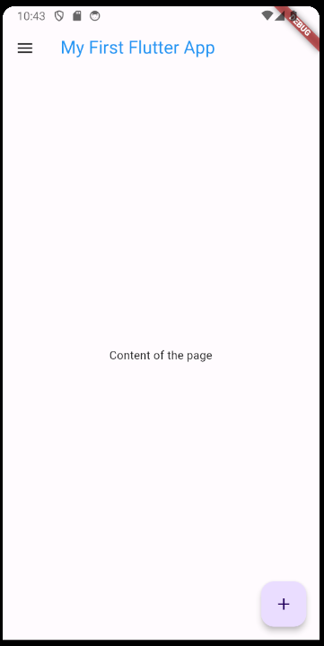

# My First Flutter App

This is my first Flutter app, created as part of learning Flutter development.

## Getting Started

To get a local copy of this project up and running, follow these simple steps.

### Prerequisites

- Flutter SDK: Follow the [installation instructions](https://flutter.dev/docs/get-started/install) for your operating system.

### Installing

1. Clone the repository to your local machine:

   ```bash
   git clone https://github.com/anaserrami/My-First-Flutter-App.git
   ```
2. Navigate to the project directory:

    ```bash
    cd My-First-Flutter-App
    ```

3. Run the app:

   ```bash
   flutter run
   ```

## Built With

Flutter - The framework used for building the app.

## Features

- Displays a simple text message on the screen.
- Includes a floating action button that does nothing when pressed.

## Screenshots



